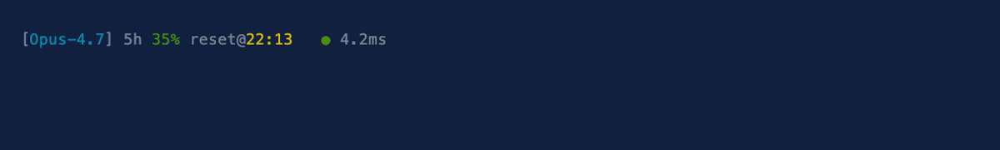

# claude-link

> **Stop wondering whether Claude is thinking, your network is slow, or your request just died.**

A real-time network monitor for [Claude Code](https://claude.com/claude-code)'s statusline. Shows the *actual* state of your API request — uploading prompt, waiting for first byte, streaming response back — with real HTTPS connect-time RTT alongside.



```
[Opus-4.7] ⬆ 42K/s             ● 4ms       ← sending prompt
[Opus-4.7] ⏳ 2.1s              ● 4ms       ← sent, waiting for response
[Opus-4.7] ⬇ 12K/s             ● 4ms       ← streaming back
[Opus-4.7] ⬆ 5K/s   ⬇ 8K/s    ● 4ms       ← both directions
[Opus-4.7] ● 4ms       ← idle, calm
```

## Why

Every existing Claude Code statusline plugin shows **quotas and token counts**. None of them answer the question you actually have when you hit Enter and Claude goes quiet:

> *"Is Claude thinking, or is my network broken?"*

claude-link watches the kernel-level traffic between your Claude Code processes and `api.anthropic.com`, plus probes real HTTPS connect RTT, and tells you exactly which phase your request is in — at 1 Hz, with a 3-second visual hold so bursty traffic doesn't flicker past you.

## Features

- **Per-session attribution** — multiple Claude Code windows? Each statusline shows only *its* session's traffic, not a confusing global sum.
- **Real RTT, not ICMP** — uses `curl --connect-timeout` so TUN-mode proxies (Quantumult X, Surge, Mihomo) don't short-circuit the measurement to a fake local IP.
- **Phase awareness** — distinguishes `⬆ uploading prompt` / `⏳ waiting for first byte` / `⬇ streaming response` / `… active` / idle.
- **Bursty-traffic friendly** — held visual state for 3s after each burst, so slow statusline redraws never miss the indicator.
- **Background-job aware** — detects Claude Code's bg job processes whose `comm` is truncated to `/Users/.../...` (parent walk fallback).
- **No always-on noise** — when nothing is happening, only ping shows. Zero values don't pollute the bar.

## Install

```bash
# In Claude Code:
/plugin marketplace add 3dnow/claude-link
/plugin install claude-link
```

Then wire the statusline into `~/.claude/settings.json`:

**If you don't have a statusline yet:**

```json
{
  "statusLine": {
    "type": "command",
    "command": "claude-link-statusline"
  }
}
```

That uses the default layout shown above.

**If you already have a statusline:**

Append `claude-link-fragment` at the end of your existing statusline command. Set `CC_NET_SESSION_ID` from the JSON Claude Code pipes in:

```bash
# your existing statusline script
input=$(cat)
# ... your existing rendering ...
export CC_NET_SESSION_ID=$(echo "$input" | jq -r '.session_id // empty')
exec claude-link-fragment
```

Then **restart Claude Code** to pick up the plugin's hooks and background monitor.

## How it works

```
┌─────────────────┐   ┌──────────────────┐   ┌─────────────────────┐
│ UserPromptSubmit│   │       Stop       │   │  background daemon  │
│  hook (per sid) │   │  hook (per sid)  │   │  (plugin monitor)   │
│        ↓        │   │        ↓         │   │          ↓          │
│ /tmp/claude-link-state-<sid>.json     │   │  nettop streaming   │
│                                       │   │  via PTY (1Hz batch)│
│  pid resolved by walking parent chain │   │     +               │
│  for `comm=claude` OR args containing │   │  curl HTTPS RTT     │
│  "/share/claude/versions/"            │   │  probe (every 15s)  │
└────────────────────┬──────────────────┘   └─────────┬───────────┘
                     │                                 │
                     ▼                                 ▼
              ┌──────────────────────────────────────────────┐
              │     /tmp/claude-link-status.json (1Hz)       │
              │  { pids: { 32746: { phase, speed_in, ... }} │
              │    sessions: { sid → pid mapping }           │
              │    aggregate: { ... } }                      │
              └──────────────────────┬───────────────────────┘
                                     │
                                     ▼
                       claude-link-fragment (statusline)
                          renders ⬆/⬇/⏳/● using
                          $CC_NET_SESSION_ID to pick view
```

## Requirements

- **macOS** (uses `nettop`, `pty`, `ps` flags specific to BSD). Linux/Windows: PRs welcome.
- **Python 3.7+** (uses `pathlib.Path.unlink(missing_ok=True)`).
- **Claude Code v2.1.105+** (plugin monitors framework).
- `jq`, `curl` — both present in macOS default + most dev setups.

No `sudo` needed; `nettop` works at user-level.

## Caveats

- **DNS-hijacking TUN proxies** still resolve `api.anthropic.com` to a fake local IP, so the ICMP ping you might run from a terminal looks sub-millisecond. claude-link sidesteps this by using `curl --connect-timeout` which reports the *real* TCP-handshake RTT through whatever proxy path is in play.
- **Cumulative byte counters** mean each PID's `bytes_in`/`bytes_out` from `nettop` only go up; the daemon takes deltas across 1Hz samples. Processes that exit between samples are dropped from the tracker.
- **Threshold tuning**: download is sensitive (100 B/s — token streams are small), upload less so (1024 B/s — avoid TLS keepalive noise). Tweak in `lib/cc-netd.py` if your traffic pattern is different.

## Configuration

Currently config is via constants at the top of `lib/cc-netd.py`. The most useful ones:

| Constant         | Default | Purpose                                                       |
| :--------------- | :-----: | :------------------------------------------------------------ |
| `PROBE_INTERVAL` | `15.0`  | seconds between curl HTTPS probes                             |
| `PHASE_OUT_BPS`  | `1024`  | bytes/s to label phase as "uploading"                         |
| `PHASE_IN_BPS`   | `100`   | bytes/s to label phase as "downloading"                       |
| `VIS_HOLD_SECS`  | `3.0`   | hold the last non-zero speed visible for this many seconds    |
| `WAIT_CAP_SECS`  | `60.0`  | longest "⏳ waiting" duration before reverting to idle        |

A future version will read these from `~/.claude/settings.json` `user_config`.

## State files

| Path | Purpose |
| --- | --- |
| `/tmp/claude-link-status.json` | snapshot written by daemon, read by statusline (1Hz) |
| `/tmp/claude-link-state-<sid>.json` | per-session hook state |
| `/tmp/claude-link.pid` | daemon singleton lock |
| `$CLAUDE_PLUGIN_DATA/claude-link.log` | daemon log |

## Roadmap

- Linux support (`/proc/<pid>/net/dev` instead of `nettop`)
- `user_config` integration so users tune thresholds without editing Python
- Optional histogram sparkline: `⬇ 12K/s ▁▃▆█▆▃▁` style
- Detection of stuck requests (no traffic for >N seconds during active hook)
- Per-session lifetime stats (total bytes per turn)

## License

MIT — see [LICENSE](LICENSE).

## Contributing

Issues and PRs welcome. If you're on Linux/Windows and want this, that's the highest-impact PR — abstract the platform-specific bits behind a `NettopFeed`-style interface.
